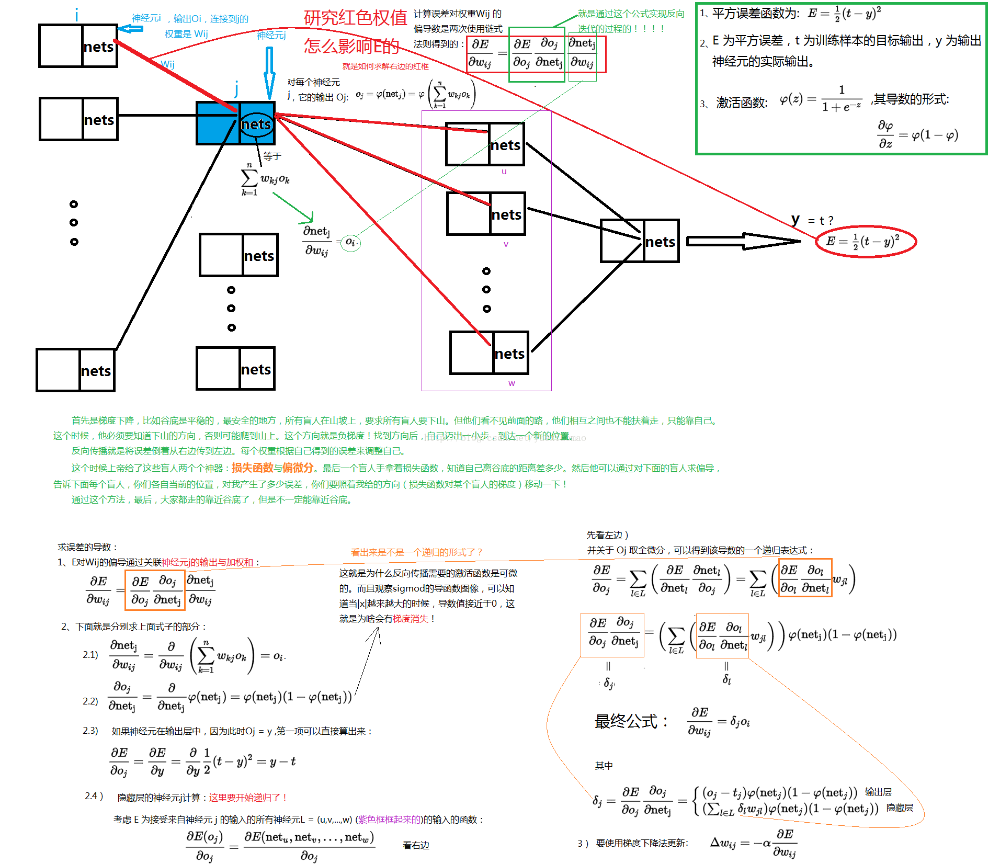

# 目录

<!-- TOC -->

- [1. 图像预处理](#1-图像预处理)
- [2. 深度学习基础](#2-深度学习基础)
- [3. 常见的卷积神经网络](#3-常见的卷积神经网络)
- [4. 图像检索](#4-图像检索)
- [5. 目标检测](#5-目标检测)
- [6. 图像分割](#6-图像分割) 

<!-- /TOC -->

# 1. 图像预处理
## 颜色空间
RGB颜色空间 R G B

一个图像的维度为 长 宽 颜色通道

HSV颜色空间  色调 饱和度(越靠近中间越红,边上越白) 亮度
 
CIE-XYZ颜色空间 基于人类颜色视觉进行的定义(对蓝色的变化敏感)

## 图片格式 
BMP JPG GIF PNG

## 图像增强的目标
改善图像的视觉效果,转换为更适合于人或机器分析处理的形式

## 图像处理方法
### 1. 空间域处理:
#### 点运算:HE CLAHE

直方图均衡化:利用图像直方图对对比度进行调整的方法,实质上是对图像进行非线性拉伸.
重新分配各个灰度单位中的像素点数量,使一定灰度范围像素点数量的值大致相等.

自适应直方图均衡(AHE)算法通过对局部区域进行直方图均衡来解决上述问题.

移动模板在原始图片上按特定步长滑动;
每次移动后魔板区域内做直方图均衡,映射后的结果赋值给模板区域内所有点.
每个点都会有多次赋值,最终的取值为这些赋值的均值.

CLAHE
AHE会过度放大图像中相对均匀的噪音,可采用限制对比度自适应直方图均衡(CLAHE)
算法步骤
a.图像分块
b.先计算直方图,然后修剪直方图,最后均衡
c.遍历操作各个图像快,进行块间双线性插值
d.与原图做图层滤色混合操作

#### 形态学运算:腐蚀膨胀

#### 邻域运算:卷积 金字塔
滤波/卷积:在每个图片位置(x,y)上进行基于邻域的函数计算
滤波函数->权重相加
卷积核 卷积模板
$$h[x,y] = \sum_{k,l}{f[k,l]I[x+k,y+l]}$$

不同功能需要定义不同的函数:平滑/去噪, 梯度/锐化, 边缘/显著点/纹理, 模式检测

边界扩充(padding)
卷积的结果一定会使图像大小缩小,需要进行边界填充,获得相同尺寸输出的情况下,卷积核越大,补充越多.
补充类型:补零(zero-padding),边界复制(replication),镜像(reflecting),块复制(wraparound)

3x3的卷积核需要补充一圈,5x5的卷积核需要补充两圈
尽量不要用太大的卷积核去对小的图像做卷积

均值滤波 图像变模糊,细节消失,去噪的效果不明显

中指滤波 有效去除椒盐噪声

平滑高斯滤波 
$$G_{\sigma} = \frac{1}{2\pi\sigma^2}e^{-\frac{x^2+y^2}{2\sigma^2}}$$
根据高斯公式生成一个矩阵,模拟人眼,关注中心区域 主要参数有标准差$\sigma$

$\sigma$越小,关注区域越集中
$\sigma$越大,会变得越模糊
主要用于高斯金字塔操作(当图片离得越远时通过高斯滤波的可以达到图像清晰度相同的效果)

高斯核分解特性(级联高斯)
2D卷积拆分成两个相同的1D卷积:列卷积和行卷积 从k*k次计算降低到了2k次计算

梯度Prewitt滤波/卷积 水平检测和垂直检测
梯度Sobel 水平上有梯度,垂直上有高斯平滑 检测水平梯度和垂直梯度
梯度Laplacian滤波/卷积 二阶微分算子 滤波锐化

图像金字塔化:先对图像进行高斯平滑,然后进行降采样
直接降采样和高斯+降采样:高斯可以让图像更加连贯

拉普拉斯金字塔:高频细节在卷积核下采样过程中会消失,Laplacian可以保留所丢失的高频信息,用于图像恢复.通过上采样可以恢复图像.

### 2. 频率域处理
#### 傅里叶变换
重要作用:信号分解
欧拉公式:
$$e^{ix} = cosx +isinx$$
$$e^{i\pi}+1=0$$
傅里叶变换公式:
$$f(t)=\frac{1}{2\pi} \int F(w)e^{iwt}dw$$

一般一幅图片傅里叶变换后是一个对称的图片

#### 小波变换

# 2. 深度学习基础

## CNN 卷积神经网络

### 多层网络的层的通俗:
层实现了输入神经网络到输出神经网络的线性或非线性变换.

### 前馈神经网络的目标函数:
$$J(w)=\frac{1}{2}||t-z||^2=\frac{1}{2}\sum_{k=1}{(t_k-z_k)}^2$$

(t为输出值,y为目标值)

前面的$\frac{1}{2}$是为了求导方便.

如何计算目标函数的最小值?

梯度下降法:先确定一个初始点,将w按照梯度下降的方向进行调整,就会使得J(w)往更低的方向进行变化,算法的结束将是在w下降到无法继续下降为止.

$$w(m+1)=w(m)+\Delta w(m) = w(m)- \beta \frac{\Phi J}{\Phi w} $$

### 输出层权重改变量和隐藏层权重改变量的求解示意图(特别重要)

### 随机梯度下降(SGD)
通过每个样本来迭代更新一次,如果样本量很大的情况,那么可能只用其中部分的样本就已经迭代到最优解了.但是SGD的一个问题是噪音较BGD要多,使得SGD并不是每次迭代都向着整体最优化方向.

#### 批量梯度下降
每迭代一次都要用到所有的数据,得到的是一个全局最优解,但是如果样本很大,那么迭代速度会很慢.

#### Mini-batch Gradient Descent
在批量梯度下降和随机梯度下降两种方法中取折中,每次从所有训练数据中提取一个子集用于计算梯度.

广义条件下SGD指的就是MBGD

# 3. 常见的卷积神经网络

## Alexnet
ImageNet-2012竞赛第一

5个卷积核+3个全连接层

60M个参数+650k个神经元

2个分组,使用两个GTX580GPU训练了5~6天

ReLU非线性激活

Max Pooling池化

Dropout regularization

## VGG
一个大卷积核分解成连续多个小卷积核

核分解:7*7核->3个3*3核(由ReLU连接)

参数数量:49C^2->27C^2(C通道数)

减少参数,降低计算,增加深度

## GoogLeNet
ImageNet-2014竞赛第一

进化顺序

为了提升性能,减少参数,降低性能.

Inception V1网络

核心组件 Inception Architecture(稀疏连接架构)
* Split-Merge->1x1卷积 3x3卷积 5x5卷积 3x3池化 增加网络对多尺度的适应性和网络宽度
* BottleNeck Layer->使用NiN的1x1卷积进行特征降维,大幅度降低计算量
* 取消全连接 参数量大,减负(AlexNet的全连接层计算量太大)
* 辅助分类器 解决前几层的梯度消失问题

## ResNet

# 4. 图像检索

## 传统做法

#### EMD距离(推土机距离)

#### 相似颜色检索

#### bag of visual word

#### PHOG

## 基于深度学习的方法

#### 迁移学习
要训练一个网络来识别猫和狗,若从头训练,需要数以百万的带标签数据,还有GPU资源.

使用迁移学习,使用VGG16这样成熟的网络进行物品分类,只训练softmax层,只需要几千张图片,使用普通CPU就能完成,模型的准确性也不差.

## 索引加速
#### KD-Tree
一种用于多维度检索的二叉平衡树

输入N个D维空间的数据点

构建过程:
* 确定split值:方差最大的维度
* 确定分割点:在split维度上的中值点, 其次为根节点
* 确定分割面:通过分割点,垂直split维度的超平面
* 确定左右子树

#### 局部敏感哈希

# 5. 目标检测
ILSVRC竞赛()

检测图片中所有物体的:
* 类别标签
* 位置(最小外接矩形/Bounding Box)

实例分割:判断每一个像素属于谁

## 区域卷积神经网络(R-CNN)系列
模型结构按照分类问题进行对待,提取物体区域,对区域进行识别

* 1 Select search获取区域
* 2 区域预处理,Bounding Box 膨胀,变成227x227
* 3 Alexet网络
* 4 线性SVMs分类器,对CNN特征进行分类
* 5 Bounding Box回归模型

性能评价
* True Positive区域:IoU >= 0.5
* False Positive区域:IoU < 0.5
* False Negative区域:遗漏的Ground Truth 区域
* 准确率precision:TP/(TP+FP)
* 召回率recall:TP/(TP+FN)
* mAP:所有类别的平均精度求和除以所有类别数,即数据集中所有类的平均精度的平均值.

## SPP-Net 2014

## Fast-RCNN 2014
实现端到端的单阶段训练

多任务损失函数

## Faster R-CNN 2015
集成RPN(Region Proposal Network)网络
## YOLO系列 2016

### YOLO V1

### YOLO V2

### YOLO V3

# 6. 图像分割

①什么是图像分割？
- [十分钟看懂图像语义分割技术](https://www.leiphone.com/news/201705/YbRHBVIjhqVBP0X5.html)
- [图像分割发展综述](https://zhuanlan.zhihu.com/p/37618829)
- [图像分割的衡量指标详解](https://blog.csdn.net/qq_37274615/article/details/78957962)
- [如何制作将分割数据集封装成tfrecords](https://blog.csdn.net/qwe2508/article/details/81180613#commentBox)

②综述类/总结类：

- [从全连接层到大型卷积核：深度学习语义分割全指南](https://mp.weixin.qq.com/s?__biz=MzA3MzI4MjgzMw==&mid=2650728920&idx=4&sn=3c51fa0a95742d37222c3e16b77267ca&scene=21#wechat_redirect)
- [分割算法——可以分割一切目标（各种分割总结）](https://mp.weixin.qq.com/s/KcVKKsAyz-eVsyWR0Y812A)

③深度学习语义分割模型的介绍：

- [语义分割(semantic segmentation) 常用神经网络介绍对比-FCN SegNet U-net DeconvNet](https://blog.csdn.net/zhyj3038/article/details/71195262)
- [深度学习（十九）——FCN, SegNet, DeconvNet, DeepLab, ENet, GCN](https://blog.csdn.net/antkillerfarm/article/details/79524417)

④图像分割的衡量指标：

- [图像分割的衡量指标详解](https://blog.csdn.net/qq_37274615/article/details/78957962)

语义分割其实就是对图片的每个像素都做分类。其中，较为重要的语义分割数据集有：VOC2012 以及 MSCOCO。
